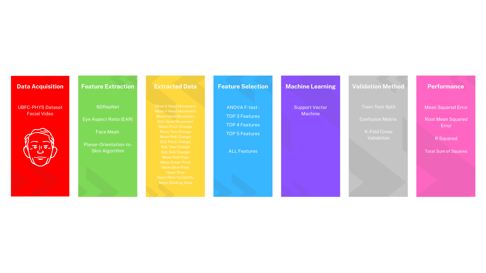

# Facial based Anxiety Prediction from facial videos 
A final project for my machine learning class to predict anxiety from facial video. This repository includes the extracted dataset and the machine learning implementation, mainly focusing on the impact of feature selection on the performance of machine learning prediction. All of the steps to achieve this are listed in the provided graph below.

